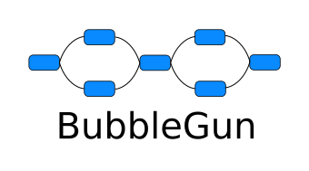
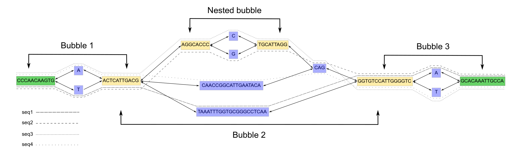

- [BubbleGun](#bubblegun)
  * [Installation](#installation)
  * [Use Cases](#use-cases)
  * [Example graph](#example-graph)
  * [Usage and Subcommands](#usage-and-subcommands)
    + [bchains](#bchains)
    + [chainout](#chainout)
    + [compact](#compact)
    + [biggestcomp](#biggestcomp)
    + [bfs](#bfs)



# BubbleGun
This work is published [here](https://academic.oup.com/bioinformatics/advance-article/doi/10.1093/bioinformatics/btac448/6633304?login=true) 

A tool for detecting Bubbles and Superbubble in De-bruijn graphs. BubbleGun outputs runs of bubbles and superbubbles we call bubble chains.
Several graph-related functions are also implemented in BubbleGun:
- Graph compacting (merging linear stretches of single nodes),
- Extracting the biggest connected component in the graph
- Separating certain chains by their id for further examination
- Extracting a user-specified neighborhood size around a node to extract as a separate graph for examination
- Extracting two random paths from each bubble chain for haplotyping
- Extracting information from long reads aligned to bubble chains

BubbleGun keeps all optional information in the S (Segment) lines and re-writes them in th output GFA. However, if the graph is compacted then output GFA file doesn't have these optional information, the problem is that when compacting some nodes will be merged and it's not always clear how these optional information can be updated for merged noded. 
## Installation

BubbleGun can be installed with pip:
```
pip install BubbleGun
```

Or can be installed using the setup script simply with this command:
```
python3 setup.py install
```

In case you do not have admin access or want to install BubbleGun locally for the user, then `--user` can be added after `install`. And the binaries will usually be added to `~/.local/bin` on Linux systems. 
This will also download the needed dependencies and creat a callable entry point for the tool, and it should be added to the path, so `BubbleGun` can be called anywhere to get the CLI and then be used.

## Use cases
Some use cases are listed [here](use_cases), there are 3 different use cases explained:

* Myxococcus xanthus de Bruijn Graph
* Myxococcus xanthus bluntified pangenome using minigraph
* HG002 de Bruijn Graph from short reads and how to produce haplotypes from simple bubble chains.

## Example graph


The graph above represents a bluntified (overlaps removed) of a de Bruijn graph with *k*-mer size of 9.
These 4 sequences are traced with the different dotted lines in the graph, and they construct a bubble chains of 3 bubbles.
2 simple bubbles and 1 superbubble with a nested simple bubble inside.

The following sections will demonstrate some examples of using this tool.

## Usage and Subcommands
The tool has several subcommands and `-h` or `--help` can be used to print the help message.
```
usage: BubbleGun [-h] [-g GRAPH_PATH] [--log LOG_LEVEL]
                 {bchains,compact,biggestcomp,bfs,chainout} ...

Find Bubble Chains.

Subcommands:
  {bchains,compact,biggestcomp,bfs,chainout}
                        Available subcommands
    bchains             Command for detecting bubble chains
    compact             Command for compacting graphs
    biggestcomp         Command for separating biggest component
    bfs                 Command for separating neighborhood
    chainout            Outputs certain chain(s) given by their id as a GFA
                        file

Global Arguments:
  -h, --help            show this help message and exit
  -g GRAPH_PATH, --in_graph GRAPH_PATH
                        graph file path (GFA or VG)
  --log LOG_LEVEL       The logging level [DEBUG, INFO, WARNING, ERROR,
                        CRITICAL]

```
As shown, it takes some Global arguments then specific subcommands. The global arguments `-g` is required, for an input graph and input *k*-mer size respectively.
Individual help messages for the subcommands can be called by using the subcommand then followed by `-h` or `--help`


### bchains

This subcommand is for detecting bubble and superbubble chains.
The following help page is available for bchains
```
usage: BubbleGun bchains [-h] [--bubble_json OUT_JSON] [--only_simple]
                         [--only_super] [--save_memory]
                         [--chains_gfa CHAINS_GFA] [--fasta FASTA]
                         [--out_haplos]

optional arguments:
  -h, --help            show this help message and exit
  --bubble_json OUT_JSON
                        Outputs Bubbles, Superbubbles, and Chains as a JSON
                        file
  --only_simple         If used then only simple bubbles are detected
  --only_super          If used then only simple bubbles are detected
  --save_memory         Identifies bubble chain with less memory. No
                        statistics outputted
  --chains_gfa CHAINS_GFA
                        Output only bubble chains as a GFA file
  --fasta FASTA         Outputs the bubble branches as fasta file (doesn't
                        work with memory saving)
  --out_haplos          output randomly two haplotypes for each chain (doesn't
                        work with memory saving)
```
Examples:
* A user wants to detect chains and output JSON file with information about the bubbles and low memory usage.
. With saving memory, only the graph topology will be stored in memory, and the sequences will not be read from the file.
Command:

  `BubbleGun -g test_graph.gfa bchains --bubble_json test_graph_chains.json`
* A user wants to detect chains and output a new GFA graph with only the bubble chains.
Command:

  `BubbleGun -g test_graph.gfa bchains --chains_gfa chains_output.gfa`
* A user wants to detect chains and output a FASTA file with only bubble branches sequences (currently only works for simple bubbles), 
where the sequence name indicate from which chains and which bubble they come from. Command:

  `BubbleGun -g test_graph.gfa bchains --only_simple --fasta test_output.fasta`
 
For the previous example, the JSON and FASTA output can be seen in [example](example)
* Of course, all the previous commands can be combined in one to output a JSON, a GFA and a FASTA.
  `BubbleGun -g test_graph.gfa -k 9 bchains --only_simple `
  
### chainout
This subcommand separates a chain or several chains by their ids according to the JSON file.
The following help page is available for the chainout subcommand:
```
usage: BubbleGun chainout [-h] [--json_file JSON_FILE]
                          [--chain_ids CHAIN_IDS [CHAIN_IDS ...]]
                          [--output_chain OUTPUT]

optional arguments:
  -h, --help            show this help message and exit
  --json_file JSON_FILE
                        The JSON file wtih bubble chains information
  --chain_ids CHAIN_IDS [CHAIN_IDS ...]
                        Give the chain Id(s) to be outputted
  --output_chain OUTPUT
                        Output path for the chains chosen
```

Example command:

`BubbleGun -g test_graph.gfa chainout --json_file test_graph_chains.json --chain_ids 10 13 30 --output_chain test_output.gfa`

The ids given should be present in the JSON file and the graph given should be the same graph used to generate the JSON file.

### compact
This subcommand outputs a compacted GFA file.

```
usage: BubbleGun compact [-h] PATH_COMPACTED

positional arguments:
  PATH_COMPACTED  Compacted graph output path

optional arguments:
  -h, --help      show this help message and exit

```
Example:
`BubbleGun -g test_graph.gfa compact compacted_test.gfa`


### biggestcomp
This subcommand separates the biggest component in the graph and outputs it.

```
usage: BubbleGun biggestcomp [-h] PATH_BIG_COMP

positional arguments:
  PATH_BIG_COMP  Biggest component output path

optional arguments:
  -h, --help     show this help message and exit

```
Example:
`BubbleGun -g test_graph.gfa biggestcomp biggest_comp.gfa`


### bfs
This subcommand can be used to extract a neighborhood using BFS around a start node or several start nodes (takes the node id), these neighborhood will be outputted as a GFA file.

```
usage: BubbleGun bfs [-h] [--start START_NODES [START_NODES ...]] [--neighborhood_size SIZE]
                     [--output_neighborhood OUTPUT]

optional arguments:
  -h, --help            show this help message and exit
  --start START_NODES [START_NODES ...]
                        Give the starting node(s) for neighborhood extraction
  --neighborhood_size SIZE
                        With -s --start option, size of neighborhood to extract
  --output_neighborhood OUTPUT
                        Output neighborhood file
```
Examples:
* Extracting a neighborhood of size 100 nodes around the node with id 540

  `BubbleGun -g test_graph.gfa bfs --start 540 --neighborhood_size 100 --output_neighborhood output.gfa`
* Extracting the neighborhoods of size 100 nodes around nodes 500, 540, and 1509. Regardless if these neighborhood are connected or not, they all will be in the same output file.

  `BubbleGun -g test_graph.gfa bfs --start 500 540 1509 --neighborhood_size 100 --output_neighborhood output.gfa`

[comment]: <> (### gamdigest)

[comment]: <> (This subcommand filters an alignemnt GAM file.)

[comment]: <> (The following help is available for this subcommand:)

[comment]: <> (```)

[comment]: <> (usage: main.py gamdigest [-h] [--json_file JSON_FILE] [--alignment_file GAM])

[comment]: <> (                         [--min_cutoff MIN_CUTOFF] [--out_dict PICKLE_OUT])

[comment]: <> (optional arguments:)

[comment]: <> (  -h, --help            show this help message and exit)

[comment]: <> (  --json_file JSON_FILE)

[comment]: <> (                        The JSON file wtih bubble chains information)

[comment]: <> (  --alignment_file GAM  Take GAM file and output pickled dict)

[comment]: <> (  --min_cutoff MIN_CUTOFF)

[comment]: <> (                        The minimum cutoff of a mapping length.)

[comment]: <> (  --out_dict PICKLE_OUT)

[comment]: <> (                        A pickled dictionary output path. contains)

[comment]: <> (                        read_id:[nodes])

[comment]: <> (```)

[comment]: <> (This command is used to "filter" a GAM file which is an alignment file of reads aligned to the graph. This mainly works on the output from [GraphAligner]&#40;https://github.com/maickrau/GraphAligner&#41; after aligning long reads to the graph.)

[comment]: <> (GraphAligner outputs a GAM files which this commands takes along with the bubble chain graph aligned to and a minimum length cutoff for mappings. Each read would have several mappings, first, all mappings that are smaller than the cutoff are dicarded, then if the same read mapped to the same chain more than once, the longest mapping is kept.)

[comment]: <> (The output is a pickled dictionary with keys as read names and values as a list of nodes the read have mapped to. This pickled dictionary along with the graph can be given then to Whatshap phaseb command to output phased bubbles according to how the long reads mapped to these bubbles, but this is still under construction.)

[comment]: <> (Example command:)

[comment]: <> (`./main.py gamdigest --json_file test_graph_chains.json --alignment_file test_alignment.gam --min_cutoff 200 --out_dict alignment_dictionary.pickle`)
